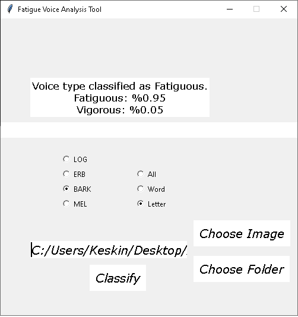
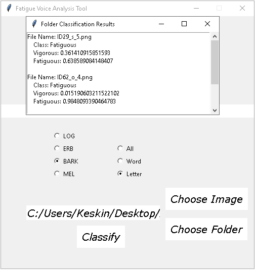

# Fatigue Voice Analysis Tool

A software that classifies the spectrogram image
using saved convolutional neural network model entered
according to the spectrogram type and voice type that
spectrogram converted from selected by the user has been
developed for making predictions on new images collectively
or singularly.

---

---

