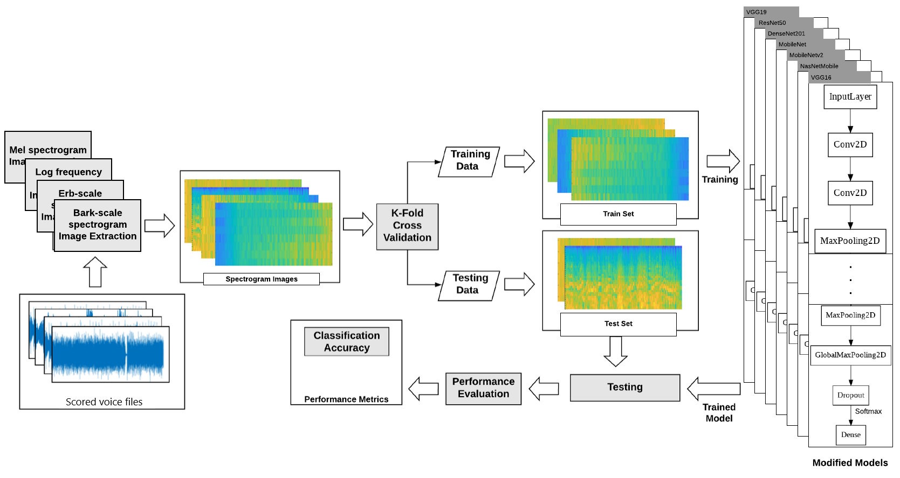

# Fatigue-Voice-Analysis
My 3 Months of Research and Project about Fatigue Voice Analysis using Transfer Learning and Convolutional Neural Networks. 

Approximately 3000 spectrogram images of voices gathered and converted and grouped to 4 types of spectrograms (MEL-scale, BARK-scale, ERB-scale, LOG-scale) using MATLAB, 4 types of labeling and 2 types of voices (Letter voices and Word voices) by my advisors on university were used to classify and analyse fatigueness of the 
the person to which the voice belongs.

---
## System Design

The data required for training the established deep
learning model are voice spectrogram images. Images were
created separately for each of the 4 spectrographic types,
BARK, ERB, LOG, MEL in MATLAB environment. These
images were labeled as tired or vigorous, with more than
one person scoring between 1-10, and different folders were
created according to their scores.
Each of the different folders created for score ranges with
each spectrogram creation method used contains 5 folders
in order to comply with the 5-fold validation architecture to
make the training more consistent and accurate.
Pre-training a CNN model using ImageNet first, and
then retraining it to adapt to a new goal has become a
standard for solving computer vision problems. In order to
find out which CNN Model will reach the solution better,
the scores of 7 artificial neural network models determined
on this project have been examined. These are Resnet50,
VGG16, VGG19, MobileNet, MobileNetV2, DenseNet201 and
NasNetMobile models.

---
## Experimental Results

MEL type spectrogram images were the highest success among all folders, with
%94.77 in test results on word folders that scored as 1 or 10. In addition, the
highest fold score achieved was obtained with MEL-type
spectrogram images with %100 .

---

 
BARK type spectrogram images with %84.17 in the test results on word
folders achieved the highest success among all folders that scored as 1, 2, 9 or 10, as
shown in the figures. In addition, the highest fold score
achieved was obtained with BARK type spectrogram images
with %93.84 .

---

MEL type spectrogram images were the highest success among all folders that scored as 1, 2, 3, 8, 9 or 10 with
%80.63 in test results on word folders. In addition, the
highest fold score achieved was obtained using LOG type
spectrogram images with %84.37 .
