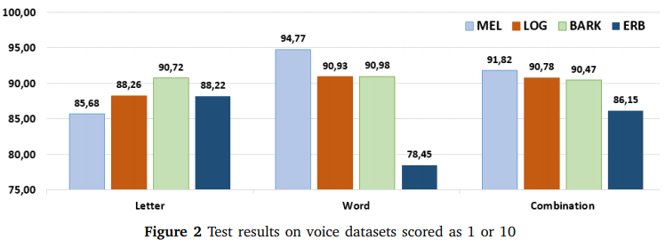
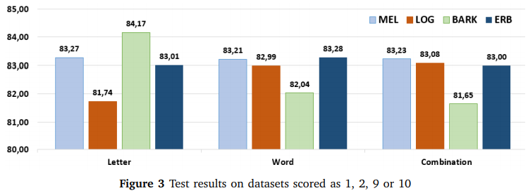
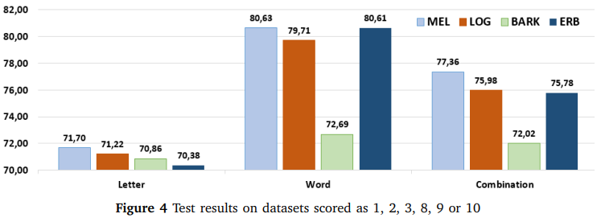

# Fatigue-Voice-Analysis
My 3 Months of Research and Project about Fatigue Voice Analysis using Transfer Learning and Convolutional Neural Networks. 

Approximately 3000 spectrogram images of voices gathered and converted and grouped to 4 types of spectrograms (MEL-scale, BARK-scale, ERB-scale, LOG-scale) using MATLAB, 4 types of labeling and 2 types of voices (Letter voices and Word voices) by my advisors on university were used to classify and analyse fatigueness of the 
the person to which the voice belongs.

---

MEL type spectrogram images were the highest success among all folders, with
%94.77 in test results on word folders that scored as 1 or 10. In addition, the
highest fold score achieved was obtained with MEL-type
spectrogram images with %100 .

BARK type spectrogram images with %84.17 in the test results on word
folders achieved the highest success among all folders that scored as 1, 2, 9 or 10, as
shown in the figures. In addition, the highest fold score
achieved was obtained with BARK type spectrogram images
with %93.84 .

MEL type spectrogram images were the highest success among all folders that scored as 1, 2, 3, 8, 9 or 10 with
%80.63 in test results on word folders. In addition, the
highest fold score achieved was obtained using LOG type
spectrogram images with %84.37 .
